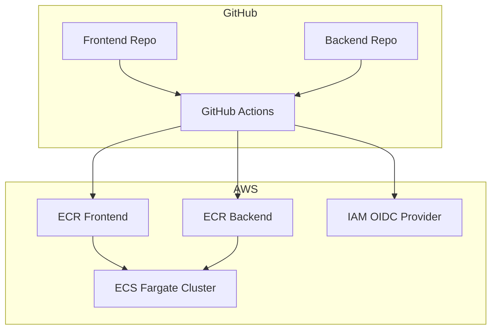

# AWS ECS CI/CD Pipeline Infrastructure

This repository contains the CI/CD infrastructure for deploying containerized applications to AWS ECS using GitHub Actions.

## Architecture Overview



## Components

### 1. Terraform Infrastructure
- **ECR Repositories**: Container registries for frontend and backend images
- **IAM Roles**: GitHub Actions OIDC authentication for secure AWS access
- **GitHub Secrets**: Automated secret creation for repository workflows

### 2. GitHub Actions Workflows
- **Backend Deployment**: Build, test, and deploy backend containers
- **Frontend Deployment**: Build, test, and deploy frontend containers
- **Rollback Support**: Automated rollback on deployment failure

## Prerequisites

1. **Existing ECS Infrastructure**: This CI/CD pipeline deploys to existing ECS services created by [terraform-aws-ecs-infra](https://github.com/sabiut/terraform-aws-ecs-infra)
2. AWS Account with appropriate permissions
3. GitHub repositories for frontend and backend applications
4. Terraform installed (>= 1.0)
5. AWS CLI configured

## Setup Instructions

### 1. Configure Terraform Variables

```bash
cd terraform
cp terraform.tfvars.example terraform.tfvars
# Edit terraform.tfvars with your configuration
# IMPORTANT: Use the same project_name and environment as your existing ECS infrastructure
```

**Key Configuration:**
- `project_name`: Must match your existing ECS infrastructure (default: "ecs-three-tier")
- `environment`: Must match your existing ECS infrastructure (default: "dev")
- `ecs_cluster_name`: Must match your existing ECS cluster name
- `ecs_frontend_service_name`: Must match your existing frontend service name
- `ecs_backend_service_name`: Must match your existing backend service name

### 2. Deploy CI/CD Infrastructure

```bash
terraform init
terraform plan
terraform apply
```

### 3. Configure GitHub Repositories

The Terraform will output:
- ECR repository URLs
- IAM role ARNs
- Required GitHub secrets

Add these as secrets to your frontend and backend repositories.

### 4. Add Workflow Files

Copy the appropriate workflow file to your application repositories:
- Frontend: `.github/workflows/frontend-deploy.yml`
- Backend: `.github/workflows/backend-deploy.yml`

## GitHub Actions Workflow

### Triggers
- Push to `main` branch
- Pull request to `main` branch
- Manual dispatch

### Deployment Process
1. **Build**: Docker image creation
2. **Test**: Run unit and integration tests
3. **Scan**: Security vulnerability scanning
4. **Push**: Upload to Amazon ECR
5. **Deploy**: Update ECS service with new image
6. **Verify**: Health check validation

## Environment Configuration

### Development
- Auto-deploy on push to `develop` branch
- Relaxed approval requirements

### Staging
- Deploy on push to `staging` branch
- Required manual approval

### Production
- Deploy on push to `main` branch
- Required manual approval
- Automated rollback on failure

## Security Features

- **OIDC Authentication**: No long-lived AWS credentials
- **Least Privilege IAM**: Minimal required permissions
- **Image Scanning**: Automated vulnerability detection
- **Secret Management**: GitHub Secrets integration
- **Audit Logging**: CloudTrail integration

## Monitoring

- **GitHub Actions Dashboard**: Workflow execution status
- **AWS CloudWatch**: Container logs and metrics
- **ECR Scan Results**: Security vulnerability reports

## Rollback Strategy

Automatic rollback triggers:
- ECS deployment failure
- Health check failures
- Custom metric thresholds

Manual rollback:
```bash
# Via GitHub Actions UI
# Re-run previous successful workflow
```

## Cost Optimization

- **ECR Lifecycle Policies**: Automatic old image cleanup
- **On-demand CI/CD**: Resources only used during deployments
- **GitHub Actions**: Free tier for public repositories

## Troubleshooting

### Common Issues

1. **Permission Denied**
   - Verify IAM role trust relationship
   - Check GitHub OIDC thumbprint

2. **ECR Push Failed**
   - Verify ECR repository exists
   - Check IAM permissions

3. **ECS Deployment Failed**
   - Review CloudWatch logs
   - Verify task definition
   - Check security groups

## Repository Structure

```
.
├── .github/
│   └── workflows/
│       ├── backend-deploy.yml
│       └── frontend-deploy.yml
├── terraform/
│   ├── main.tf
│   ├── variables.tf
│   ├── outputs.tf
│   ├── terraform.tfvars.example
│   └── modules/
│       ├── ecr/
│       ├── iam/
│       └── github-secrets/
└── README.md
```

## Related Repositories

This CI/CD infrastructure works with the following repositories:

- **ECS Infrastructure**: [terraform-aws-ecs-infra](https://github.com/sabiut/terraform-aws-ecs-infra) (deploy this first)
- **CI/CD Pipeline**: [aws-ecs-cicd-pipeline](https://github.com/sabiut/aws-ecs-cicd-pipeline) (this repository)
- **Django Backend**: [aws-ecs-backend-django](https://github.com/sabiut/aws-ecs-backend-django)
- **Next.js Frontend**: [aws-ecs-frontend-react](https://github.com/sabiut/aws-ecs-frontend-react)

## Complete Setup

**Deployment Order:**
1. **Deploy ECS Infrastructure** from [terraform-aws-ecs-infra](https://github.com/sabiut/terraform-aws-ecs-infra) first
2. **Deploy this CI/CD infrastructure** (configure with matching ECS names)
3. **Configure GitHub secrets** for both application repositories
4. **Push to application repositories** to trigger deployments

## Contributing

1. Create feature branch
2. Make changes
3. Test locally
4. Submit pull request

## Support

For issues or questions, please create a GitHub issue.