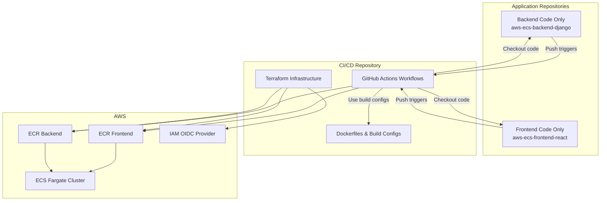

# AWS ECS CI/CD Pipeline Infrastructure

This repository contains the centralized CI/CD infrastructure for deploying containerized applications to AWS ECS using GitHub Actions.

## Architecture Overview



## Key Features

### **Centralized Build Management**
- All Dockerfiles and build configurations are in this CI/CD repository
- Application repositories contain only source code
- Consistent build process across all applications

### **Repository Dispatch Architecture**
- Application repositories trigger deployments via repository dispatch events
- CI/CD workflows checkout code from application repositories
- Clean separation of concerns between code and deployment

### **Secure Deployment**
- OIDC authentication (no long-lived AWS credentials)
- Least privilege IAM policies
- Automated vulnerability scanning
- Rollback capabilities

## Prerequisites

1. **Existing ECS Infrastructure**: This CI/CD pipeline deploys to existing ECS services created by [terraform-aws-ecs-infra](https://github.com/sabiut/terraform-aws-ecs-infra)
2. AWS Account with appropriate permissions
3. GitHub repositories for frontend and backend applications
4. Terraform installed (>= 1.0)
5. AWS CLI configured

## Repository Structure

```
.
├── .github/
│   └── workflows/
│       ├── backend-deploy.yml    # Backend deployment workflow
│       └── frontend-deploy.yml   # Frontend deployment workflow
├── docker/
│   ├── backend/
│   │   ├── Dockerfile
│   │   └── requirements.txt
│   └── frontend/
│       ├── Dockerfile
│       ├── package.json
│       └── next.config.js
├── terraform/
│   ├── main.tf
│   ├── variables.tf
│   ├── outputs.tf
│   ├── terraform.tfvars.example
│   └── modules/
│       ├── ecr/
│       ├── iam/
│       └── github-secrets/
└── README.md
```

## Setup Instructions

### 1. Configure Terraform Variables

```bash
cd terraform
cp terraform.tfvars.example terraform.tfvars
# Edit terraform.tfvars with your configuration
# IMPORTANT: Use the same project_name and environment as your existing ECS infrastructure
```

**Key Configuration:**
- `project_name`: Must match your existing ECS infrastructure (default: "ecs-three-tier")
- `environment`: Must match your existing ECS infrastructure (default: "dev")
- `ecs_cluster_name`: Must match your existing ECS cluster name
- `ecs_frontend_service_name`: Must match your existing frontend service name
- `ecs_backend_service_name`: Must match your existing backend service name

### 2. Deploy CI/CD Infrastructure

```bash
terraform init
terraform plan
terraform apply
```

### 3. Configure GitHub Secrets

The Terraform will output the required secrets. Add these to your repositories:

**CI/CD Repository Secrets:**
- `AWS_REGION`
- `AWS_ACCOUNT_ID`
- `AWS_ROLE_ARN`
- `ECS_CLUSTER`
- `ECR_FRONTEND_REPOSITORY`
- `ECR_BACKEND_REPOSITORY`
- `ECS_FRONTEND_SERVICE`
- `ECS_BACKEND_SERVICE`

**Application Repository Secrets:**
- `CICD_TRIGGER_TOKEN`: GitHub token with repository dispatch permissions

### 4. Application Repository Setup

Application repositories need minimal workflow files to trigger the CI/CD pipeline. These are already included in the application repositories:

- **Backend**: `.github/workflows/trigger-deploy.yml`
- **Frontend**: `.github/workflows/trigger-deploy.yml`

## Deployment Workflow

### **How it Works:**

1. **Developer pushes code** to application repository (frontend or backend)
2. **Trigger workflow** runs in application repository
3. **Repository dispatch event** sent to CI/CD repository
4. **CI/CD workflow** activates in this repository:
   - Checks out code from application repository
   - Uses centralized Dockerfiles and build configs
   - Builds and pushes Docker image to ECR
   - Deploys to ECS Fargate
   - Performs health checks and rollback if needed

### **Deployment Process:**
1. **Test**: Run linting and tests on application code
2. **Build**: Create Docker image using centralized configs
3. **Scan**: Security vulnerability scanning
4. **Push**: Upload to Amazon ECR
5. **Deploy**: Update ECS service with new image
6. **Verify**: Health check validation
7. **Rollback**: Automatic rollback on failure

## Environment Configuration

### Development
- Auto-deploy on push to `develop` branch
- Basic testing requirements

### Staging
- Deploy on push to `staging` branch
- Enhanced testing and validation

### Production
- Deploy on push to `main` branch
- Full testing, security scans, and approval gates
- Automated rollback on failure

## Related Repositories

This CI/CD infrastructure works with the following repositories:

- **ECS Infrastructure**: [terraform-aws-ecs-infra](https://github.com/sabiut/terraform-aws-ecs-infra) (deploy this first)
- **CI/CD Pipeline**: [aws-ecs-cicd-pipeline](https://github.com/sabiut/aws-ecs-cicd-pipeline) (this repository)
- **Django Backend**: [aws-ecs-backend-django](https://github.com/sabiut/aws-ecs-backend-django)
- **Next.js Frontend**: [aws-ecs-frontend-react](https://github.com/sabiut/aws-ecs-frontend-react)

## Complete Setup

**Deployment Order:**
1. **Deploy ECS Infrastructure** from [terraform-aws-ecs-infra](https://github.com/sabiut/terraform-aws-ecs-infra) first
2. **Deploy this CI/CD infrastructure** (configure with matching ECS names)
3. **Configure GitHub secrets** for all repositories
4. **Push to application repositories** to trigger automated deployments

## Manual Deployment

You can manually trigger deployments via GitHub Actions UI:

1. Go to Actions tab in this repository
2. Select "Deploy Backend to ECS" or "Deploy Frontend to ECS"
3. Click "Run workflow"
4. Specify the branch/ref from the application repository to deploy

## Troubleshooting

### Common Issues

1. **Repository Dispatch Not Working**
   - Verify `CICD_TRIGGER_TOKEN` has repository dispatch permissions
   - Check token scope includes the CI/CD repository

2. **Code Checkout Fails**
   - Verify application repository is accessible
   - Check branch/ref exists in application repository

3. **Build Fails**
   - Check Dockerfiles in `docker/` directory
   - Verify build configurations match application structure

4. **Deployment Fails**
   - Verify ECS cluster and service names match
   - Check AWS permissions and role trust relationship

## Security Features

- **OIDC Authentication**: No long-lived AWS credentials
- **Least Privilege IAM**: Minimal required permissions
- **Image Scanning**: Automated vulnerability detection
- **Secret Management**: GitHub Secrets integration
- **Audit Logging**: CloudTrail integration
- **Code Separation**: Application code never mixed with deployment configs

## Contributing

1. Create feature branch
2. Make changes to workflows or infrastructure
3. Test with manual deployment
4. Submit pull request

## Support

For issues or questions, please create a GitHub issue.